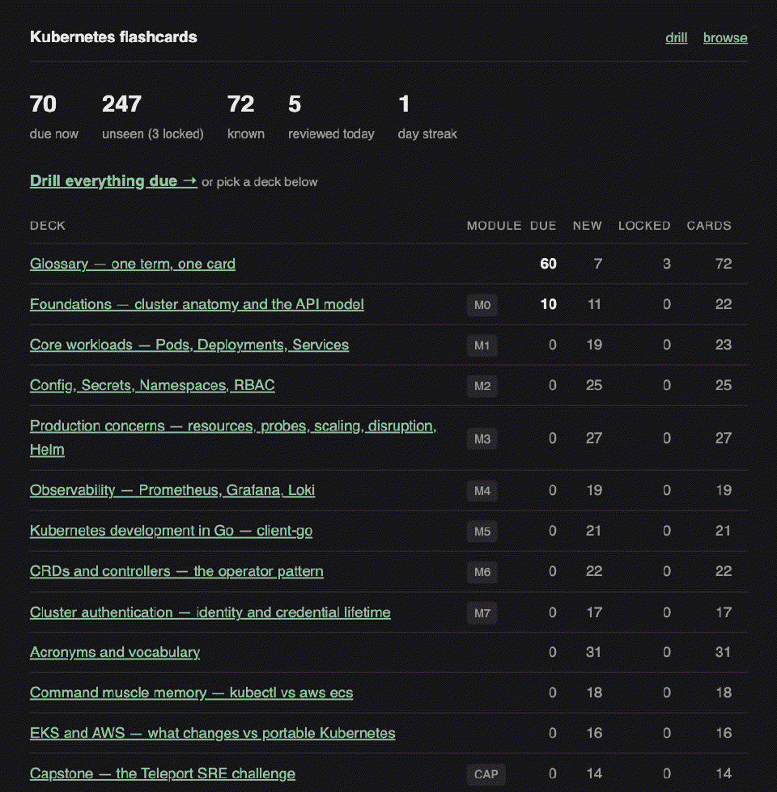
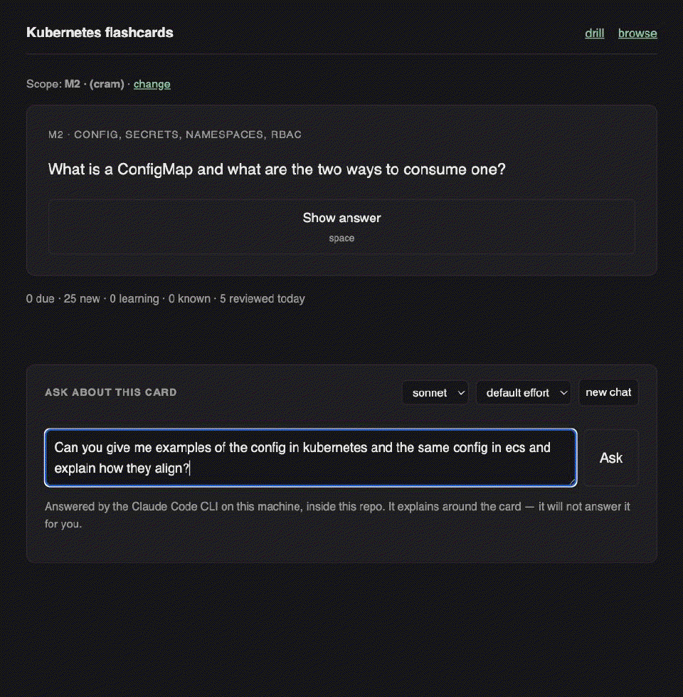

# Kubernetes Training Program

[](LICENSE)

> This repository is public as a learning artifact and portfolio piece. It's a
> personal, solo program written in the first person — you're welcome to read it,
> run the flashcard app, and borrow anything useful. It isn't seeking outside
> contributions, and issues/PRs may go unanswered.

A guided, hands-on program to take me from **deep AWS ECS/Fargate experience
and zero Kubernetes** to being able to pass the take-home coding challenges
for the [target roles](docs/target-roles.md) I'm applying to — culminating
in the Teleport SRE challenge (a Go service that talks to the Kubernetes API).

## Who this is for

Me: an engineer with extensive AWS ECS/Fargate/container experience learning
Kubernetes. Every concept here is framed against what I already know from ECS,
and every exercise is held to a **production-realism** bar rather than "it ran
locally."

## Environment constraint: no cloud account

**Everything in this program runs locally on KIND. No exercise requires an AWS
account or any cloud credentials.**

AWS is the *teaching anchor*, not the *tooling*. My ECS/Fargate experience is
what every concept gets explained against, and I still need to speak fluently
about EKS, IRSA, Secrets Manager, and CloudWatch in interviews — so they stay in
the explanations. But nothing hands-on depends on them. Where a module would
naturally reach for a managed AWS service, we substitute a self-hosted
equivalent and explain what the managed version would do differently:

| Production on AWS | This program (local, on KIND) | Kept as knowledge |
|---|---|---|
| Secrets Manager / SSM Parameter Store | **HashiCorp Vault** in-cluster, fronted by **External Secrets Operator** | how the ECS `secrets` / `valueFrom` model compares |
| IRSA / EKS Pod Identity | **Vault Kubernetes auth** (ServiceAccount token → TokenReview) | the Task Role → workload identity mapping |
| ALB + AWS Load Balancer Controller | **ingress-nginx** | Ingress is portable; only the controller differs |
| CloudWatch Container Insights / `awslogs` | **Prometheus + Grafana + Loki** | why K8s ships no logging pipeline at all |
| ECR | local images via `kind load docker-image` | registry auth as a pull-secret problem |
| EKS managed control plane | KIND (1 control-plane + 2 workers) | what AWS manages vs. what stays mine |

This is a feature, not a workaround: the target roles want **portable**
Kubernetes skill, and substituting self-hosted components forces me to learn
the mechanism rather than the AWS console button.

## How the program works

This is a **guided build-up**: we go module by module together. Each module
follows the same loop:

1. **Learn** — the concept, anchored to its ECS/Fargate equivalent, with the
   real-world production concerns it raises.
2. **Do** — a hands-on exercise on a real (local) cluster.
3. **Review** — I show my work; Claude reviews it against a production bar and
   the relevant Teleport challenge level.
4. **Advance** — mark the module done and move on.

Modules are authored **just-in-time** as I reach them (not all up front), so
each one can build on how the previous exercise actually went.

From M1 on, the thing being deployed is **[the flashcard app](flashcards/)** —
a small Go service built for this program — rather than a stock nginx image. It
gets hardened module by module as the curriculum reaches each concept, and by
M5 it's the scaffold that starts talking to the Kubernetes API.

## The roadmap

This table is the progress tracker — ✅ done · 🚧 in progress · ⏳ not started.
Update the marker as each module's **Done when** bar is met.

| # | Module | ECS anchor | Teleport challenge level it feeds |
|---|--------|-----------|-----------------------------------|
| 🚧 M0 | Local production-shaped cluster (Docker Desktop + KIND, kubectl) | Spinning up an ECS cluster — but you now see the control plane and nodes | Tooling for all levels |
| ⏳ M1 | Core workloads: Pods, Deployments, Services | Task Def → Pod spec; ECS Service → Deployment; target-group wiring → K8s Service | L1–L2 |
| ⏳ M2 | Config, Secrets, Namespaces, RBAC (+ Vault & External Secrets Operator) | Task env vars / Secrets Manager refs → ConfigMap/Secret; Task IAM role → ServiceAccount | L3, L5 (Role/RoleBinding) |
| ⏳ M3 | Production concerns: limits, probes, HPA, PDB, NetworkPolicy, Helm, Ingress | Task CPU/mem, health checks, service autoscaling, ALB | L3 (Helm, zero-downtime upgrade) |
| ⏳ M4 | Observability: Prometheus, Grafana, Loki | CloudWatch Container Insights / awslogs — but self-hosted | L3 health checks; SRE JD core |
| ⏳ M5 | Kubernetes development in Go (client-go, informers/watches) | Imperative one-shot ECS API calls → a long-running client that watches & reacts | L1–L4 server |
| ⏳ M6 | CRDs + controllers (the operator pattern) | **No ECS equivalent** — genuinely new | L5 |
| ⏳ M7 | Cluster authentication: identity & short-lived credentials | IAM is ECS's whole story; K8s stacks authn *and* RBAC — and has **no User object** | — (interview/incident depth) |
| ⏳ CAP | Capstone: the Teleport SRE take-home, leveled 1→5 | The whole thing, for real | L1–L5 |

Detailed objectives, exercises, and "done when" criteria for every module
live in **[docs/curriculum.md](docs/curriculum.md)**.

## Repo layout

```
kubernetes-for-ecs-engineers/
├── README.md                 # you are here
├── LICENSE                   # MIT
├── SECURITY.md               # how to report a vulnerability privately
├── AGENTS.md                 # how work gets done here (spec-first workflow, conventions)
├── CLAUDE.md                 # thin import of AGENTS.md
├── docs/
│   ├── target-roles.md       # the real jobs + take-home challenges this is grounded in
│   ├── curriculum.md         # full module-by-module spec
│   └── specs/                # one directory per feature; TEMPLATE.md at its root
├── modules/
│   └── 00-setup/             # each module gets a directory as we reach it
│       └── README.md
└── flashcards/               # spaced-repetition drill + the program's example workload
    ├── decks/                # 329 cards, ECS-anchored: a glossary tier plus one deck per module
    └── ...                   # small Go + htmx service, containerized
```

## Drilling the vocabulary

Concepts, vocabulary, and acronyms live in **[flashcards/](flashcards/)** —
329 cards scheduled with FSRS spaced repetition, every one anchored to its
ECS/Fargate equivalent or explicitly flagged as having none.

<p align="center">
  
</p>

`decks/00-glossary.yaml` is a **glossary tier**: 72 cards, one term apiece,
defined in isolation. Concept cards declare the terms they depend on with
`requires:`, and a card is not introduced until those terms are retained — so
vocabulary arrives before the concepts that use it, not after. A filtered drill
pulls in the terms it needs, so `/drill?module=M0` teaches M0's vocabulary as
part of M0. Cram mode (`?cram=1`) ignores all of this on purpose.

A glossary term is introduced as **recognition** before it is drilled as
recall: while the card is new, the drill asks you to pick its definition out of
four, and the pick grades itself — right is *Good*, wrong is *Again*, with the
correct option shown either way. Once the term is retained it reverts to free
recall, which stays the retention bar. Concept and checkpoint cards are always
free recall.

The wrong options are picked automatically from confusable siblings — terms
sharing a tag, or pulled in together by the same card — and re-roll daily.
`distractors: [id, id, id]` on the card overrides that pick by naming other
glossary cards, for the terms whose automatic siblings read as also-correct.

A card marked `checkpoint: M0` is a **checkpoint card** — a synthesis question
that examines the whole module rather than teaching one thing. It gets a
`requires:` edge to every card in that module automatically, and it stays out
of the ordinary drill queue until its module's checkpoint is passed.

```bash
cd flashcards && make run     # http://localhost:8080
```

Drill by module (`/drill?module=M3`) to stay inside what you've covered. The
dashboard's **locked** count is cards waiting on vocabulary you haven't
retained yet — it shrinks as the glossary lands.

### Ask about a card

`make run-chat` adds a tutor panel to the drill view — it shells out to a
logged-in `claude` CLI running locally inside this repo. Ask it to expand on the
card in front of you and it anchors the answer to the ECS/Fargate equivalent;
because a drill whose answers are one question away stops being recall practice,
it explains *around* the card rather than handing you its answer.

<p align="center">
  
</p>

```bash
cd flashcards && make run-chat   # http://localhost:8080, with the chat panel
```

### Checkpoints

`/checkpoint?module=M0` is the module's **knowledge bar**: a short set of
synthesis questions that need several cards combined, not any single one
recalled. It only opens once every card in the module is retained, and it
passes only on a clean sweep — every card *Good* or *Easy* in one sitting. Any
*Again* or *Hard* fails the attempt (the remaining cards are still shown, as a
diagnostic) and the retake opens the next day. Passed checkpoint cards join the
normal drill rotation; unpassed ones stay out of it entirely.

Passing a module's checkpoint is the knowledge half of that module being done.
The practical half stays with the module's **Done when** bar in
[docs/curriculum.md](docs/curriculum.md); the dashboard shows each checkpoint's
state but never flips a roadmap marker for you.

## How work starts

Every non-trivial piece of work in this repo starts as a written technical spec
under **[docs/specs/](docs/specs/)** — one directory per feature, copied from
[docs/specs/TEMPLATE.md](docs/specs/TEMPLATE.md). We write and refine the spec
first, then implement it, ticking its checkboxes as tasks land.

The full workflow and the conventions agents follow live in
**[AGENTS.md](AGENTS.md)**.

## Start here

Open **[modules/00-setup/README.md](modules/00-setup/README.md)** and work
through it. When `kubectl get nodes` shows a healthy multi-node cluster, come
back and we'll review and move to M1.

## Ground rules

- **Production realism by default.** No exercise is "done" just because it
  runs. We surface the real-world gaps (limits, probes, RBAC, secrets
  backing, disruption budgets, observability) even when an exercise's happy
  path doesn't require them.
- **K8s development, not just operations.** The target roles want Go code that
  talks to the Kubernetes API, so the program leans that way from M5 on.
- **The real interview submission is my own work.** This program is practice
  and portfolio. Teleport's challenge explicitly says not to outsource the
  actual take-home to AI — so the capstone here is a rehearsal, and the real
  submission gets written by me.

## Security

Found a security issue in the flashcard app? Please report it privately — see
**[SECURITY.md](SECURITY.md)**.

## License

Released under the [MIT License](LICENSE). © 2026 Isaac Stefanek.
