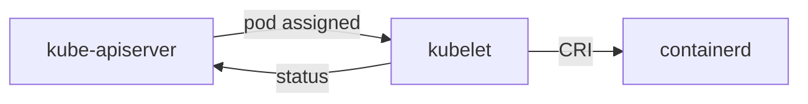

# Card Diagrams — Technical Spec

**Status**: ⏳ PLANNED
**Last updated**: 2026-08-01

---

## Overview

Several flashcards teach a *sequence* — the kubelet pull loop, reconciliation,
graceful shutdown, the API request path — but render as prose, so the ordering
has to be reconstructed mentally on every review. This spec adds Mermaid
diagrams to the cards whose content is a flow, rendered by the
`goldmark-mermaid` extension to the goldmark parser the app already uses
(`flashcards/internal/web/web.go:63`), and proves the convention on the M0
(`01-foundations`) deck before it spreads.

Mermaid-in-fenced-blocks is the industry standard (GitHub, GitLab, Obsidian all
render it natively), which satisfies `AGENTS.md`'s "prefer established tools
over hand-rolled ones" — a bespoke box-drawing dialect with a bespoke lint was
considered and rejected for exactly that rule. The MermaidJS runtime is
vendored into `static/`, following the existing `htmx.min.js` precedent; no CDN
and no network dependency.

The runtime is 3.4 MB against `htmx.min.js`'s 50 KB, so the embedded binary
grows by about that much. Accepted: the binary is a local study tool, not a
distributed artifact, and a CDN would trade that size for a network dependency
the training cluster is meant to run without.

---

## Business Requirements

### Learning Objectives

- A card whose answer is a sequence shows that sequence as a picture, so the
  order and direction of control are recalled visually rather than reassembled
  from prose.
- Diagram labels use the same vocabulary as the card text, so a diagram never
  introduces a term the card has not earned.

### Production Bar

- A diagram renders correctly in both light and dark themes.
- A diagram renders when its card arrives via an htmx swap — the reveal path —
  not only on full page load.
- A diagram never silently disables the vocabulary gate. Every glossary term
  appearing in a diagram is detected by `make lint-decks` and carries a
  `requires:` edge, exactly as prose does.
- The convention is enforced by a test, not by reviewer memory, and that test
  keeps working if the vocabulary scanner is later refactored.
- No CDN or network fetch: the renderer ships in the binary like every other
  static asset.

---

## Technical Requirements

### Kubernetes Resources

**Not applicable** — deck content, one Go dependency, and web wiring only.

### Go Components

```text
- `internal/web/web.go` — add `mermaid.Extender` (go.abhg.dev/goldmark/mermaid)
  to the goldmark extension list, configured `RenderMode: RenderModeClient` and
  `NoScript: true`. Both are load-bearing; see **Rendering Integration**.
- `internal/web/templates/layout.html` — the single `<script src=
  "/static/mermaid.min.js">`, the `mermaid.initialize` call carrying the theme,
  and the `htmx:afterSwap` listener. This is the only place the runtime is
  referenced.
- `internal/web/static/mermaid.min.js` (new, vendored) — MermaidJS 11.16.0
  browser bundle. No embed change is needed: `web.go:27` already embeds
  `static/*`, which is also how `htmx.min.js` ships.
- `internal/deck/diagram_test.go` (new) — the two deck lints below, named
  `TestDiagram*` for what they actually check.
- `flashcards/Makefile:48` — widen `lint-decks` from `-run 'TestGlossary'` to
  `-run 'TestGlossary|TestDiagram'` so the diagram lints run there too. The
  alternative — naming them `TestGlossaryDiagram*` to match the existing filter
  — makes the test name lie about its subject to satisfy a build-file string;
  the one-line Makefile edit is the smaller debt.
- `internal/web/web_test.go` — `TestMarkdownMermaidHasNoCDN`, holding the
  no-network requirement to a test rather than a one-time observation. The file
  is `package web_test` (`internal/web/web_test.go:1`), so `markdown()` is not
  reachable directly; the test drives the reveal handler against a fixture deck
  whose card carries a `mermaid` block.
```

### Rendering Integration

Four integration points the extension does not solve by itself. All four were
settled by reading `go.abhg.dev/goldmark/mermaid@v0.6.0`; Phase 1 implements
them rather than rediscovering them.

1. **Render mode must be pinned.** `RenderMode` defaults to `RenderModeAuto`,
   which switches to *server-side* rendering whenever `mmdc` happens to be on
   `$PATH` — so a machine with mermaid-cli installed silently produces different
   output, and server mode shells out to Node. Set `RenderModeClient`
   explicitly.
2. **The extension's own script tag must be suppressed.** In client mode it
   appends `<script src="…"></script><script>mermaid.initialize({startOnLoad:
   true});</script>` to the end of every converted document. `markdown()`
   (`internal/web/web.go:284`) is called once per card *field*, so a card with a
   diagram would re-inject that pair into the swapped-in fragment on every
   reveal. Set `NoScript: true` and put one `<script src>` plus one
   `initialize` call in `layout.html`, which is what the extension's `NoScript`
   field is for.
3. **Theme is ours to set, once per page load.** The extender's `Theme` field is
   documented as ignored in client mode, so it cannot carry this. The app themes
   by `prefers-color-scheme` with no runtime toggle, so `layout.html` picks
   `dark` vs `neutral` from `matchMedia` in its single `mermaid.initialize`
   call. That sample is taken at load: **a diagram's theme is fixed for the life
   of the page**, and an OS theme change mid-session restyles the CSS but leaves
   diagrams as they were until reload. Accepted rather than fixed — re-theming
   a rendered diagram means re-injecting its source, since `mermaid.run()`
   consumes the node it renders, and this is a single-user local study tool that
   is not mid-session theme-switching. Verify by loading in each theme, not by
   toggling a live page.
4. **htmx swaps.** Cards arrive via `hx-post` swaps
   (`internal/web/templates/fragments.html`) — the reveal that shows `a:` *is* a
   swap — and with `startOnLoad` no longer firing, nothing renders a swapped-in
   diagram. An `htmx:afterSwap` listener must call `mermaid.run()` over the
   swapped content. The vendored bundle's last statement is
   `globalThis["mermaid"] = …`, so `window.mermaid` is set and the listener can
   reach it.

The extension renders each block as `<pre class="mermaid">`. `layout.html`
already styles bare `pre` with a code-block background, padding, and
`overflow-x: auto`, which would frame every diagram as a grey code box, so
`pre.mermaid` needs its own rule resetting the background and padding.

### Diagram House Style

Phase 1 ships these rules as `flashcards/decks/README.md`, which is
**authoritative for authors** from the moment it lands. This section states
them once so they can be implemented and reviewed, and keeps the reasoning —
that is what stops a later cleanup removing a rule that looks arbitrary. Do not
maintain a second copy anywhere else.

A diagram is a fenced block tagged `mermaid` inside `a:`:

````text

````

The hazard the rules exist for: `termUse`
(`internal/deck/glossary_test.go:710`) uses `[^0-9A-Za-z_-]` as its word
boundary, so `-` and `_` are *word characters* and a glossary term touching
either is invisible to the vocabulary gate. Verified behaviour:

| Text | Term `kubelet` detected |
| --- | --- |
| `kubelet-->CRI` | **no** |
| `kubelet_status` | **no** |
| `K[kubelet] --> C` | yes |
| `kubelet --> C` | yes |
| `-->\|kubelet\|` | yes |
| `API[kube-apiserver]` | yes, for term `kube-apiserver` |

Note what is *not* a hazard: a hyphen inside a term (`kube-apiserver`,
`kube-proxy`) is fine, because the label's `[` and `]` are boundaries and the
term the gate looks for contains that hyphen itself. Only a `-` or `_`
separating a term from something else hides it.

Rules, applying to `mermaid` blocks only:

1. **Arrows are space-separated** — `A --> B`, never `A-->B`. This is the rule
   that keeps diagrams inside the vocabulary gate; the rest are hygiene.
2. **No `_` adjacent to an alphanumeric.** Node ids and labels use spaces or
   hyphens, not underscores.
3. **Prefer bracket labels for glossary terms** (`K[kubelet]` over a bare
   `kubelet` node id). Not lintable and not a hazard once rule 1 holds — a
   space-separated bare term is detected fine — but labels keep ids short and
   keep the term legible in the rendered diagram.
4. **`flowchart` only** (any direction), until a card genuinely needs another
   type. One diagram vocabulary is one thing to learn to read.
5. **A diagram supplements the prose; it does not replace it.** The answer must
   still read correctly with the diagram removed, because the diagram is the
   recall aid, not the content.

`TestDiagramStyle` enforces rules 1, 2, and 4 as: no arrow operator
(`-->`, `---`, `-.->`, `==>` and their variants) directly preceded or followed
by `[0-9A-Za-z_]`; no `_` directly preceded or followed by `[0-9A-Za-z]`; first
directive line is `flowchart`. Deliberately *not* "no `-` adjacent to a word
character" — that reading rejects `kube-apiserver` and, since `-` is itself a
word character under `termUse`'s class, rejects every arrow too.

The 27 existing untagged fenced blocks of kubectl and YAML examples are
untouched: the `mermaid` tag is what scopes the lint. Card text is already full
of identifiers these rules would reject — `AWS_PROFILE`
(`decks/01-foundations.yaml:172`), `http_requests_total`
(`decks/05-observability.yaml:88`), `client_golang`
(`decks/05-observability.yaml:234`) — so widening the lint beyond `mermaid`
blocks would force an allowlist, the silently disabled check `AGENTS.md` warns
against. The rules are a Mermaid-authoring convention, not a deck-wide one.

### Consequences for `requires:` Edges

Because the linter scans `c.Q + "\n" + c.A` as raw text with no markdown
awareness (`internal/deck/glossary_test.go:723`), diagram labels *are* scanned.
Adding a diagram will therefore sometimes force new `requires:` edges onto a
card. That is correct behaviour, not friction to work around: the card
genuinely now uses that vocabulary. It does mean adding a diagram can move a
card later in the unlock graph, so `requires:` additions are part of the
diagram change, in the same commit.

### Observability

**Not applicable** — nothing long-running is added or changed. A diagram that
fails to render degrades to visible Mermaid source text, which is its own
signal during review.

---

## Implementation Phases

### Phase 1: Rendering, lints, one card — ⏳ PLANNED

**Objective**: Wire the renderer, encode the convention as executable checks,
and prove both on one real card before authoring a batch.

**Tasks**:

- [ ] Widen `lint-decks` in `flashcards/Makefile:48` to
      `-run 'TestGlossary|TestDiagram'`, so the lints below run there and keep
      names that describe what they check
- [ ] Add failing `TestDiagramTermsAreScanned`: a synthetic fixture card whose
      only use of a glossary term is inside a `mermaid` block, asserting
      `usesUnrequiredTerms` returns that term. This is the permanent guard that
      diagrams sit inside the vocabulary gate — both files are `package
      deck_test` (`internal/deck/glossary_test.go:1`), so the helper is
      directly callable
- [ ] Add failing `TestDiagramStyle`: for `mermaid`-tagged blocks only, no
      arrow operator adjacent to `[0-9A-Za-z_]`, no `_` adjacent to
      `[0-9A-Za-z]`, and the first directive line is `flowchart`. Include a
      table case asserting `API[kube-apiserver]` **passes** — the over-broad
      "no hyphen near a word character" reading is the trap
- [ ] Add failing `TestMarkdownMermaidHasNoCDN` in `internal/web`: driving the
      reveal handler over a fixture card containing a `mermaid` block yields no
      external host reference
- [ ] Vendor `mermaid.min.js` 11.16.0 into `internal/web/static/`, recording
      version, URL, and size in **Vendored MermaidJS**, and wire
      `mermaid.Extender` in `internal/web/web.go` with
      `RenderMode: RenderModeClient` and `NoScript: true`
- [ ] Add to `layout.html`: the `<script src="/static/mermaid.min.js">`, one
      `mermaid.initialize` picking `dark`/`neutral` from `matchMedia`, and an
      `htmx:afterSwap` listener calling `mermaid.run()`
- [ ] Add a `pre.mermaid` CSS rule so diagrams are not framed as grey code
      blocks by the existing bare-`pre` styling
- [ ] Add the diagram to `m0-kubelet-is-the-thing-that-acts` until both deck
      lints pass, adding any `requires:` edges the new labels pull in
- [ ] Verify in the browser: diagram renders on the reveal swap (not just hard
      refresh) — `make run`. Check each theme by setting the OS theme and
      loading the page, per the page-load contract in **Rendering Integration**
- [ ] Confirm the existing untagged kubectl/YAML blocks are unflagged by the
      style lint
- [ ] Write `flashcards/decks/README.md` with the rules as authoring guidance,
      citing the lint that enforces each. `AGENTS.md` is not edited
- [ ] Sync affected documentation with the implemented changes

**Deliverables**:

- `flashcards/internal/deck/diagram_test.go` — style lint and gate guard
- `flashcards/internal/web/static/mermaid.min.js` — MermaidJS 11.16.0, vendored
- `lint-decks` running both diagram lints
- Extender wired in `web.go`; runtime, theme, swap hook, and `pre.mermaid`
  styling in `layout.html`
- One diagram on `01-foundations.yaml`, passing both deck lints
- `flashcards/decks/README.md` — authoritative authoring rules

### Phase 2: M0 diagram batch — ⏳ PLANNED

**Objective**: Apply the convention to the M0 cards whose answer is a flow, and
find out where it breaks down.

The card list is fixed below, agreed before implementation. Phase 2 is done
against that list, not against a fresh judgment of what "teaches a sequence"
means.

**Diagram these six** (the seventh, `m0-kubelet-is-the-thing-that-acts`, lands
in Phase 1):

| Card | What the diagram shows |
| --- | --- |
| `m0-only-apiserver-touches-etcd` | every component → API server → etcd; nothing else reaches the store |
| `m0-reconciliation-loop` | the cycle: desired state → controller → actual state → back |
| `m0-label-selector` | Service → selector → matching Pods → endpoints |
| `m0-kube-proxy-has-no-health-checks` | readiness probe → endpoint set → kube-proxy → kernel rules |
| `m0-flat-network-model` | Pod → Pod across two nodes, no NAT in the path |
| `m0-kind-image-loading` | local build → daemon cache ✗ node store, with `kind load` as the bridge |

**Left as prose**, with the reason:

- `m0-control-plane-components` — an enumeration; the card says so itself
- `m0-checkpoint-machine-roles`, `m0-checkpoint-wrong-cluster` — checkpoints are
  self-assessed against a rubric; a diagram hands over the answer
- `m0-service-dns-name` — teaches a name format, not a path
- `m0-kubeconfig-context`, `m0-object-shape`, `m0-namespaced-vs-cluster-scoped`,
  `m0-kube-system` — structure and enumeration, no direction of control
- `m0-declarative-vs-imperative`, `m0-labels-vs-annotations`,
  `m0-nodes-are-visible-here`, `m0-describe-vs-get` — two-way contrasts; a
  diagram adds boxes, not order
- `m0-what-a-namespace-does-not-isolate` — the point is the absence of a
  boundary, which draws as nothing
- `m0-why-multi-node`, `m0-events-are-ephemeral`, `m0-api-groups`,
  `m0-kubectl-explain` — rationale, lifetime, taxonomy, tooling

**Tasks**:

- [ ] Author a diagram for each of the six cards above, adding `requires:` edges
      as the labels demand
- [ ] Review the batch in both themes at desktop and the 64rem single-column
      breakpoint; fix anything that overflows or reads worse than the prose
      alone
- [ ] Sync affected documentation with the implemented changes

**Deliverables**:

- Six diagrams across `flashcards/decks/01-foundations.yaml`
- A short note in this spec's **Technical Implementation Details** on which
  card shapes the convention did *not* suit in practice — including any card
  from the list above that turned out not to earn its diagram

---

## Test-Driven Development Requirements

### TDD Plan

- Phase 1 tests: `TestDiagramTermsAreScanned` asserts a term used *only* inside
  a `mermaid` block is still reported by `usesUnrequiredTerms`. This is a
  permanent test, not a one-time observation: it is what fails if the vocabulary
  scanner is later changed to strip code fences, which would otherwise drop
  diagrams out of the gate invisibly.
- Phase 1 tests: `TestDiagramStyle` validates the arrow-adjacency and underscore
  rules and the `flowchart` directive across every deck's `mermaid` blocks, and
  must stay green on the existing untagged code blocks. Its table carries
  `API[kube-apiserver]` as a passing case so a later tightening to "no hyphen
  near a word character" fails loudly.
- Both of the above run under `make lint-decks` via the widened
  `-run 'TestGlossary|TestDiagram'` filter, not only under `make check`.
- Phase 1 tests: `TestMarkdownMermaidHasNoCDN` in `internal/web` renders a card
  containing a `mermaid` block — through the reveal handler, since the test
  package is external and `markdown()` is unexported — and asserts the output
  references no external host. This is what keeps the no-network requirement
  true after a dependency bump: the extension's default `MermaidURL` is
  `https://cdn.jsdelivr.net/npm/mermaid/dist/mermaid.min.js`
  (`client_render.go:10`), so the failure mode is a silent revert to the
  default, not a visible error.
- Phase 2 tests: no new tests; Phase 1's lints govern the batch.
- Regression: `make check`

### TDD Exceptions

- The htmx re-run and per-load theme selection are verified by browser
  observation in Phase 1 rather than a Go test: the behaviour lives in MermaidJS
  and htmx, and a unit test would assert only that our snippet exists, not that
  it works.
  Note this covers only the two behaviours — the no-CDN property, which *is*
  mechanically checkable, gets a real test above.
- "Reads better than the prose alone" is a human judgment and has no test. It
  is the review step in each phase's task list.

---

## Technical Implementation Details

### Key Files

- `flashcards/decks/01-foundations.yaml` — the M0 cards receiving diagrams
- `flashcards/internal/web/web.go:63` — the goldmark instance gaining
  `mermaid.Extender`
- `flashcards/internal/web/web.go:284` — `markdown()`, called once per card
  field; this is why `NoScript: true` is required
- `flashcards/internal/web/templates/layout.html` — the single MermaidJS script
  tag, theme init, swap hook, and `pre.mermaid` styling
- `flashcards/internal/web/templates/fragments.html` — the htmx swaps a
  rendered diagram must survive
- `flashcards/internal/deck/diagram_test.go` — style lint and gate guard
- `flashcards/internal/deck/glossary_test.go:710` — `termUse`, whose
  word-boundary class `[^0-9A-Za-z_-]` is what makes the arrow rule necessary
- `flashcards/internal/deck/glossary_test.go:717` — `usesUnrequiredTerms`; its
  `c.Q + "\n" + c.A` scan at `:723` is raw text, which is why diagram labels are
  gated at all, and the property `TestDiagramTermsAreScanned` pins
- `flashcards/Makefile:48` — `lint-decks`; its `-run` filter widens to
  `'TestGlossary|TestDiagram'`

### Vendored MermaidJS

- Version: **11.16.0** — the latest release, pinned exactly. Not a floating
  range: the extension's own default URL is unpinned, and pinning here is what
  makes a runtime upgrade a reviewable commit.
- Source: `https://unpkg.com/mermaid@11.16.0/dist/mermaid.min.js`
- Size: 3,565,102 bytes (3.4 MB)
- Shape: despite the `.min.js` name this is not UMD — it is an esbuild IIFE
  bundle whose final statement is
  `globalThis["mermaid"] = globalThis.__esbuild_esm_mermaid_nm["mermaid"].default;`.
  That is what puts `mermaid` on `window` for the `initialize` and
  `htmx:afterSwap` calls in `layout.html`. Mermaid also ships
  `mermaid.esm.min.mjs`; do not swap to it, because a module script sets no
  global and the swap listener would have nothing to call.

### Notes

- `flashcards/decks/README.md` is invisible to the loader: the root embed is
  `//go:embed decks/*.yaml` and `deck.Load` globs `*.yaml`
  (`internal/deck/deck.go:80`). It ships in the repo, not in the binary.
- The extension is `go.abhg.dev/goldmark/mermaid` v0.6.0, which is its latest
  release. Its defaults are all wrong for this app — `RenderModeAuto`, CDN
  `MermaidURL`, script injection on, `Theme` ignored client-side — so every
  field named in **Go Components** is load-bearing. Do not simplify the
  extender config.
- `ClientRenderer.ContainerTag` defaults to `pre` (`client_render.go:28`),
  producing `<pre class="mermaid">`. Leave it at the default; the
  `pre.mermaid` CSS rule is written against it.

Remaining patterns and gotchas are filled in as the diagrams are authored.

---

## Success Criteria

- [ ] `make check` passes
- [ ] `make lint-decks` runs both new deck tests:
      `go test -run 'TestGlossary|TestDiagram' -v ./internal/deck/ |
      grep -cE '^=== RUN +TestDiagram[A-Za-z]*$'` returns 2. The `$` anchor
      matters — without it the subtest `=== RUN` lines from `TestDiagramStyle`'s
      table are counted too and the number can never be 2
- [ ] `TestDiagramTermsAreScanned` fails if `usesUnrequiredTerms` is changed to
      ignore fenced blocks
- [ ] `TestDiagramStyle` accepts `API[kube-apiserver]` and rejects
      `kubelet-->CRI`
- [ ] The `m0-kubelet-is-the-thing-that-acts` diagram renders on the reveal
      swap, observed in the browser via `make run`, and reads correctly when the
      page is loaded under each OS theme
- [ ] Every `mermaid` block in every deck passes the arrow, underscore, and
      `flowchart` rules; the existing untagged kubectl/YAML blocks are untouched
      and unflagged
- [ ] `TestMarkdownMermaidHasNoCDN` passes, and the served page fetches
      MermaidJS only from `/static/` — no `cdn.jsdelivr.net` request in the
      browser network panel
- [ ] Each of the six Phase 2 cards carries a diagram, and no card on the
      leave-as-prose list gained one
- [ ] Each diagrammed card still reads correctly with the diagram deleted
- [ ] `flashcards/decks/README.md` states every rule the lints enforce, and
      `AGENTS.md` is unchanged by this spec

---

## Troubleshooting Guide

**Not applicable** — no problems encountered yet.

---

## Future Enhancements

- Extend to M1+ decks once the M0 batch shows the convention holds.
- Admit further Mermaid diagram types (`sequenceDiagram`, `stateDiagram`) if a
  card genuinely needs one; loosen the `flowchart` lint rule then, not before.

---

## Dependencies

### External Dependencies

- `go.abhg.dev/goldmark/mermaid` v0.6.0 — the goldmark extension (BSD-3,
  maintained); latest release
- MermaidJS 11.16.0 `mermaid.min.js` — latest release, vendored and pinned, no
  runtime network access

### Internal Dependencies

- `flashcards/internal/deck/glossary_test.go` — the vocabulary gate the
  spaced-arrow rule exists to protect
- `flashcards/internal/web/static/`, embedded by `//go:embed templates/*.html
  static/*` (`internal/web/web.go:27`) — the vendoring pattern the runtime
  follows, as `htmx.min.js` already does. The `static/*` glob needs no change.
- `AGENTS.md` — the gated-vocabulary and established-tools rules this spec
  answers to (as rules; the file itself is not edited)

---

## Risks and Mitigation

### Technical Risks

- **Risk**: An idiomatic-Mermaid arrow touching a label (`kubelet-->CRI`)
  silently exempts a card from the vocabulary gate — the failure is invisible,
  because the diagram still renders and the deck still loads.
- **Mitigation**: `TestDiagramStyle` rejects arrow operators and underscores
  adjacent to alphanumerics inside `mermaid` blocks, and
  `TestDiagramTermsAreScanned` permanently pins the property that diagram text
  is scanned at all, so the gate cannot be refactored out from under the
  diagrams.

- **Risk**: The style lint is tightened to "no hyphen adjacent to a word
  character" — the obvious-looking generalisation — which rejects hyphenated
  Kubernetes terms (`kube-apiserver`, `kube-proxy`) that are already safe, and
  rejects every arrow besides, since `-` is a word character under `termUse`'s
  class.
- **Mitigation**: `TestDiagramStyle` carries `API[kube-apiserver]` as an
  explicit passing case, so the tightening fails the suite.

- **Risk**: The extension's config drifts back toward its defaults — CDN URL,
  `RenderModeAuto`, script injection — during a dependency bump or a cleanup
  that reads the explicit fields as redundant.
- **Mitigation**: `TestMarkdownMermaidHasNoCDN` catches the URL revert;
  **Technical Implementation Details** records that every field is load-bearing
  and why.

- **Risk**: The `lint-decks` filter is reverted to `-run 'TestGlossary'` — it
  reads like the tidier pattern — and the diagram lints stop running there
  silently. They still run under `make check`, so nothing goes red; the deck
  lint just quietly covers less than it claims.
- **Mitigation**: The success criterion counts `TestDiagram*` runs under
  `make lint-decks` rather than asserting the tests merely exist, so a narrowed
  filter fails the check.

- **Risk**: Diagrams render on full page load but not on the htmx swap that is
  the actual drill path, and the gap ships unnoticed because hard-refresh
  testing looks fine.
- **Mitigation**: The reveal-swap render is its own Phase 1 task and success
  criterion, verified in the browser, and the `htmx:afterSwap` hook is named in
  this spec rather than left to be discovered.

### Learning Risks

- **Risk**: A diagram becomes the thing recalled instead of the reasoning, so
  the card is answered by shape recognition without the underlying explanation.
- **Mitigation**: The answer must stand alone with the diagram deleted, checked
  per card in each phase's review task.

---

## Notes for AI Agents

Follow the workflow in `docs/specs/TEMPLATE.md` under **Notes for AI Agents**.
Specific to this spec:

1. `requires:` edges pulled in by diagram labels belong in the same commit as
   the diagram that introduced them.
2. The style lint applies to `mermaid`-tagged blocks only. If it ever starts
   flagging a kubectl or YAML example, the scoping has regressed — fix the
   scoping, do not add an allowlist and do not reword the example.
3. `flashcards/decks/README.md` is authoritative for the rules once it exists.
   Change it there and nowhere else; this spec keeps only the reasoning. Do not
   add a summary to `AGENTS.md` — that was considered and rejected.
4. Do not fetch MermaidJS from a CDN, at build time or run time, beyond the
   one-time vendoring download of the pinned version recorded under **Vendored
   MermaidJS**. Take the browser bundle (`dist/mermaid.min.js`), not the ESM
   one — the swap listener needs `window.mermaid`.
5. The lint bans *arrow operators* and underscores against alphanumerics — not
   hyphens generally. `API[kube-apiserver]` is correct and must keep passing.
   If the lint starts rejecting hyphenated Kubernetes terms, that is the bug.
6. The deck lints are named `TestDiagram*` and `make lint-decks` was widened to
   match. If a change narrows that filter back to `TestGlossary`, the lints stop
   running there — restore the filter, do not rename the tests.
